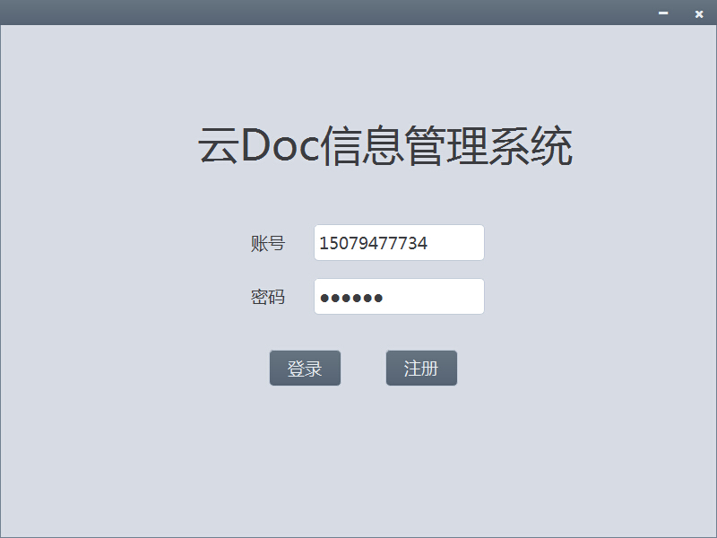
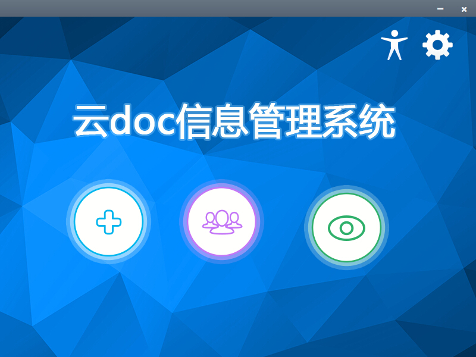
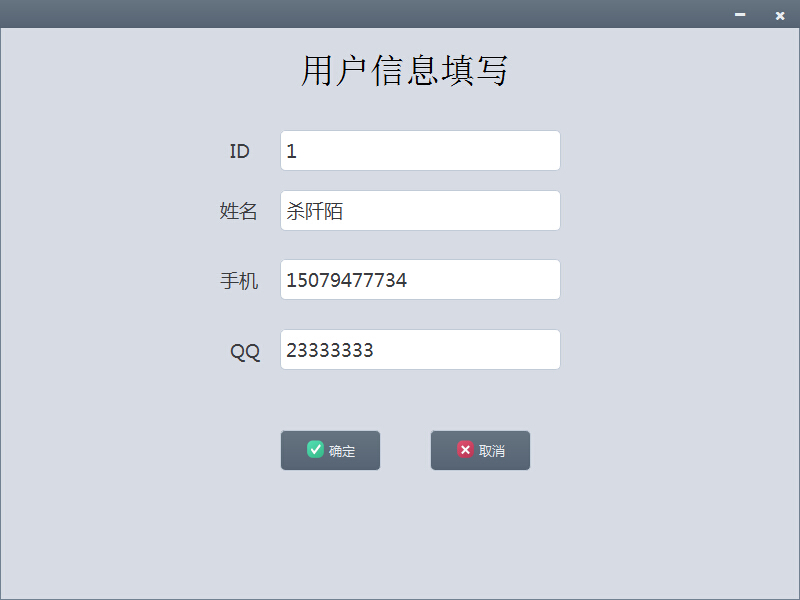
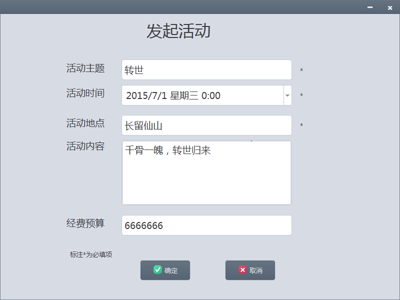
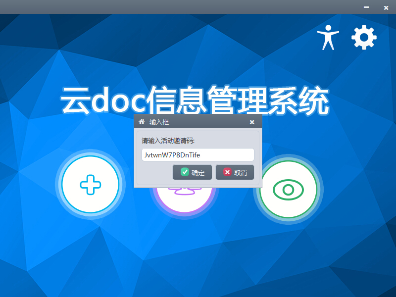

#云DOC 

项目背景：假期活动聚会频繁，如何清楚、明了的管理自己的各个活动成为当下大家急需解决的问题。项目立足于解决活动信息共享与管理的问题，实现了云端发起活动、报名参与活动、修改活动信息内容等功能，使得活动参与者足不出户了解各个活动的最新动态和安排，活动组织者更为高效的管理和设计活动。

#### [体验地址](http://7xlkp1.dl1.z0.glb.clouddn.com/CDoc.exe)

###展示：
#####登录页面

#####主页

#####填写用户信息

#####发起活动

#####活动详情

#####活动邀请码

#####我的活动

###简要说明

1.数据库用的是sqlite，配置好mysql环境，也能轻易连上mysql，

（1）取消 main.cpp的注释

       //BaseDao::set_driver("QMYSQL");

（2）配置 basedao.cpp的账户密码即可

       if(db_driver=="QMYSQL")
       {
            db=QSqlDatabase::addDatabase("QMYSQL");
            db.setHostName("localhost");
            db.setDatabaseName("cdoc");
            db.setUserName("klob");
       }
2.换肤功能实现参考  [http://www.qtcn.org/bbs/read.php?tid=58060](http://www.qtcn.org/bbs/read.php?tid=58060)

3.采用MVC模式，代码逻辑结构简单，容易理清，适合新手阅读参考

###编译配置
1. 

IDE:        Qt Creator 3.1.2 (opensource)  Based on Qt 5.3.1 (MSVC 2010, 32 bit)

Compiler:   Qt 5.3 MinGW 32bit

OS:         Windows 8.1

2.

可以直接下载，删除CDoc.pro.user，打开CDoc.pro即可编译

## Contact Me
*	email：kloblic@gmail.com
*	blog：  [klob.diandi.life](http://klob.diandi.life)

## License

    Copyright 2015 klob.diandi.life

    Licensed under the Apache License, Version 2.0 (the "License");
    you may not use this file except in compliance with the License.
    You may obtain a copy of the License at

       http://www.apache.org/licenses/LICENSE-2.0

    Unless required by applicable law or agreed to in writing, software
    distributed under the License is distributed on an "AS IS" BASIS,
    WITHOUT WARRANTIES OR CONDITIONS OF ANY KIND, either express or implied.
    See the License for the specific language governing permissions and
    limitations under the License.
